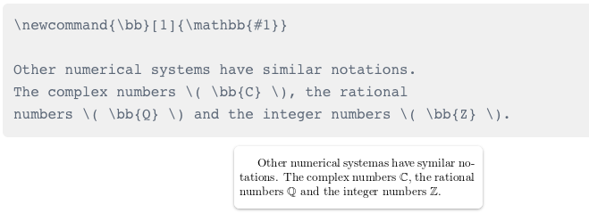

# Inchoating Latex

LATEX typesetting is done with the use of special tags or instructions that allow you to format your document in a variety of ways. When conventional commands are insufficient to meet a specific requirement, new commands can be written.

### Most of the LATEX commands are simple words preceded by a special character

- \textbf : boldface the text which can be used to emphasize something particular in a paragraph 
- \begin{itemize} : starts an environment
- \item : this is an item part of a list, and thus has to be formatted accordingly. Like a list start point
- \item[\S] : does the same as item, except that inside the brackets is \S that changes the black dot(bullet point) before the line for a special character.
- \newcommand : New commands are defined by this
- \newcommand{\R}{\mathbb{R}} : The statement \newcommand{\R}{\mathbb{R}} has two parameters that define a new command  

   
 Example1 Display

         \R  
           This is the name of the new command.  
         \mathbb{R}  
           This is what the new command does. In this case the letter R will be written in 
           blackboard boldface style.   
           
- \newcommand{\bb}[1]{\mathbb{#1}} : 

  
 
 Example2 Display

        \bb  
           This is the name of the new command.   
        [1]   
           The number of parameters the new command will take.       
        \mathbb{#1}   
           This is what the command actually does. In this case the parameter, referenced as #1, 
           will be written using blackboard boldface characters. If the   defined new command 
           needs more than one parameter, you can refer each parameter by #1, #2 and so on, 
           up to 9 parameters are supported.
